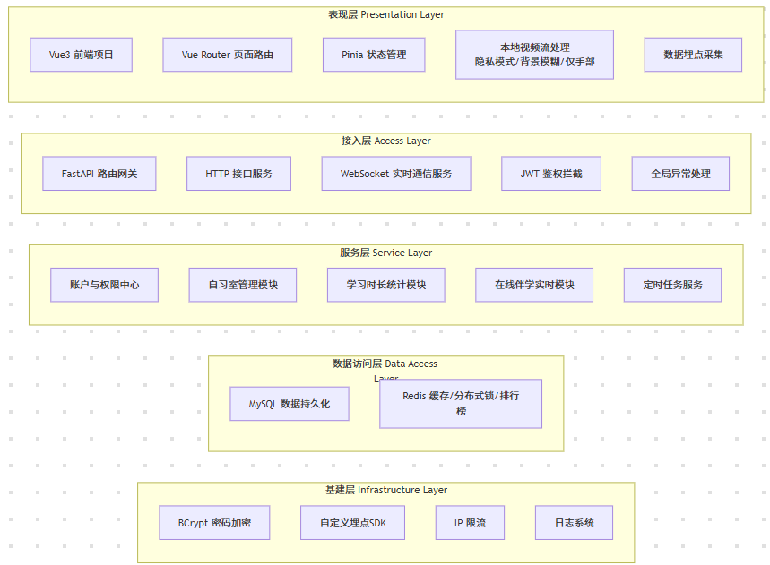
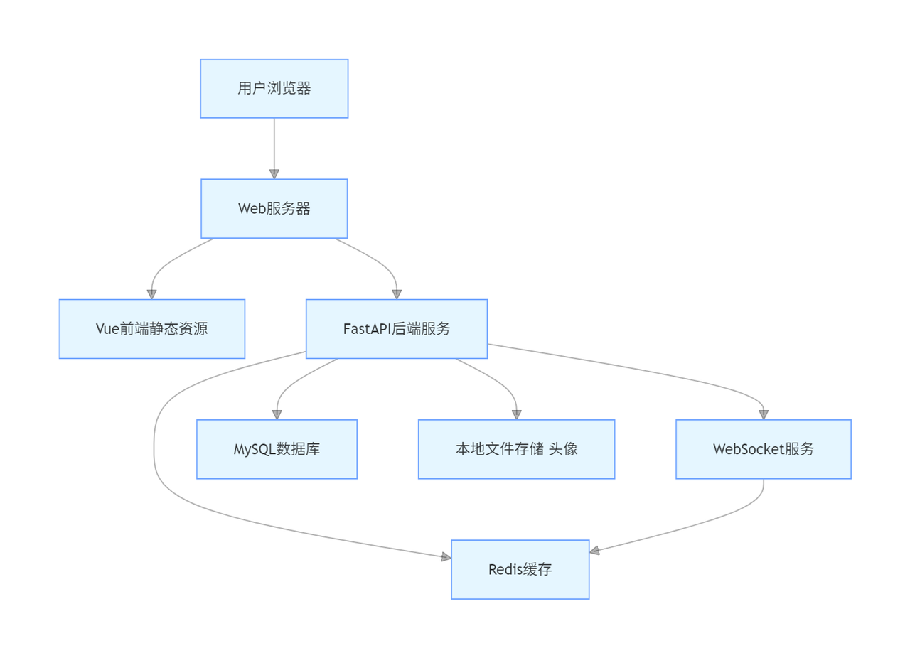
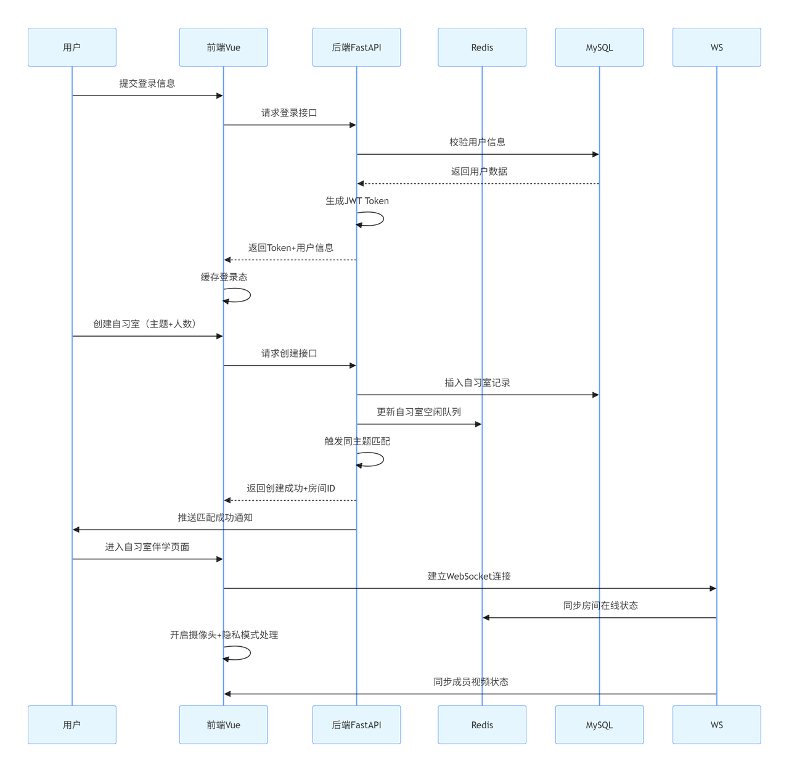

**产品概要设计文档**

**【填写指南：面向人类的全局架构共识】**

1. **阅读对象：** 指导老师、团队全体成员。

2. **核心目标：** 在让 AI 写第一行代码前，确立系统的“骨架、血液和边界”。解决技术选型、模块拆分、数据去哪儿、系统怎么部署等宏观问题。

3) **AI 协同建议：** 本文档**无需纯手工从零敲击**。请同学们将《项目立项报告》和《AI-PRD》初步的想法喂给大模型（如使用 Claude 的 Superpower 技能），让它辅助生成各章节的草案和 Mermaid 图表，然后由人类进行逻辑审查与定稿。

# **一、文档说明**

## **1.1 版本信息**

|   |   |   |
| - | - | - |

## **1.2 变更日志**

| **时间** | **版本号** | **变更人** | **主要变更内容**      |
| ------ | ------- | ------- | --------------- |
| 03.19  | V1.1    |         | 创建文件并使用AI生成初步文档 |
| 03.20  | V1.2    |         |                 |
| 03.24  | V1.2.1  |         | 上传飞书            |

## **1.3 文档说明**

## **名词解释**

| **术语 / 缩略词** | **说明**                              |
| ------------ | ----------------------------------- |
| 线上伴学         | 本项目核心产品，轻量化线上自习室，支持隐私视频伴学、主题匹配、时长激励 |
| MVP          | 最小可行产品，本次迭代仅实现核心功能                  |
| B/S          | 浏览器 / 服务器架构，本项目采用的部署架构              |
| WebSocket    | 全双工通信协议，用于自习室实时状态同步                 |
| JWT          | JSON Web Token，用户登录鉴权凭证             |
| Redis        | 内存数据库，用于缓存排行榜、自习室状态、分布式锁            |
| MySQL        | 关系型数据库，存储用户、自习室、学习时长等核心数据           |
| PRD          | 产品需求文档，本设计的需求依据                     |

# **二、项目概述与业务蓝图**

## **2.1 系统名称**

\[例如：校园闲置物品流转与信用担保系统]

**线上伴学 —— 轻量化沉浸式线上自习室系统**

## **2.2 一句话业务愿景**

打造**无冗余社交、重专注陪伴、支持学习主题匹配与隐私化视频伴学**的轻量化线上自习室，为学习人群提供高效、沉浸式、低干扰的云陪伴学习体验。

## **2.3 核心用户角色：**

**普通学习用户：注册 / 登录、创建 / 加入自习室、在线伴学、查看学习时长排行榜**

**系统管理员：用户管理、自习室状态监控、异常行为处理、学习主题配置（MVP 暂不实现）**

## **2.4 本次迭代边界**

&#x20;\[明确这次概要设计覆盖哪些功能，不覆盖哪些功能。]

**本次迭代实现（MVP）**

* 用户系统：注册、登录、退出、个人信息管理

* 自习室管理：按学习主题创建、自动匹配、加入 / 退出自习室

* 学习激励：全平台日自习时长排行榜（击败百分比展示）

* 在线伴学：隐私化视频伴学（原画 / 仅手部 / 背景模糊）、默认闭麦

* 数据埋点：全核心路径埋点，支撑用户行为分析

**本次迭代不实现**

* 付费会员、虚拟货币、装扮皮肤等娱乐化功能

* 聊天、私信、社区等强社交功能

* 课程教学、作业辅导、一对一督学功能

* 管理员后台可视化界面（仅后端接口）

# **三、全局架构分层与技术选型**

**【架构图，下面这个图是飞书的模板，大家要根据你们自己的实际情况，画出来，或者利用AI生成mermaid转换出符合你们系统结构的图】**

**【架构图的解释，对每一层具有的内容进行解释，有些同学额外有爬虫的，要考虑清楚爬虫在你的架构中是什么位置】**

| 架构分层   | 说明                    | 框架选型及理由                                                                            |
| ------ | --------------------- | ---------------------------------------------------------------------------------- |
| 表现层    | 前端界面展示、交互逻辑、视频流本地处理   | Vue3 + Vue Router + Pinia 理由：组件化开发高效、适配 B/S 架构、支持多端适配、生态成熟                    |
| 网关/路由层 | 前端路由跳转、后端接口路由分发       | 前端：Vue Router 后端：FastAPI 路由 理由：轻量无冗余、适配 MVP 快速开发                         |
| 服务层    | 核心业务逻辑、实时通信、定时任务、接口实现 | Python 3.12.5 + FastAPI WebSocket（实时通信） 理由：开发效率高、适配 AI 编程、WebSocket 支持完善 |
| 数据访问层  | 数据库读写、缓存操作、数据持久化      | MySQL 8.0（核心数据） Redis 7.0（缓存 / 分布式锁 / 排行榜） 理由：关系型数据稳定、缓存支撑高并发            |
| 工具层    | 鉴权、加密、埋点、异常处理         | JWT（鉴权）、BCrypt（密码加密）、自定义埋点 SDK 理由：安全合规、满足项目安全需求                               |

# **四、系统拓扑与数据流转**

## **4.1 系统拓扑**

【系统拓扑图】

## **4.2 业务数据流转**

【用数据流图或者时序图表示主要业务数据的交互过程,选择其中一到两个核心数据流转进行阐述】

# **五、核心子系统与模块拆解&#x20;**

| 模块名称     | 负责人 | 核心职责说明                              | 依赖的外部服务/表                              | 下一步输出的设计文档                 |
| -------- | --- | ----------------------------------- | -------------------------------------- | -------------------------- |
| 账户与权限中心  | @   | 用户注册、登录、退出、JWT 鉴权、个人信息管理、密码加密       | user 表、Redis（Token 缓存）                 | user\_auth\_design.md      |
| 自习室管理模块  | @   | 自习室创建、主题匹配、加入 / 退出、房间状态管理、自动匹配算法    | study\_room 表、room\_user 表、Redis（房间队列） | study\_room\_design.md     |
| 学习时长统计模块 |     | 时长记录、日统计、击败百分比计算、排行榜缓存、定时任务         | study\_duration 表、Redis（排行榜）           | study\_duration\_design.md |
| 在线伴学模块   |     | 视频流处理、隐私模式切换、WebSocket 实时同步、音视频权限管理 | room\_user 表、WebSocket 服务              | online\_study\_design.md   |
| 数据埋点模块   |     | 全路径埋点采集、事件上报、异常日志收集                 | 无（前端本地采集 + 后端日志                        | 埋 point\_design.md         |

# **六、数据存储与处理策略**

## **6.1 数据库设计**

### **6.1.1 逻辑结构设计**

【乌鸦脚图】

**表 1：用户表 user**

| **字段**            | **类型**       | **约束**           | **说明**      |
| ----------------- | ------------ | ---------------- | ----------- |
| id                | char(32)     | PK               | 用户唯一 ID     |
| phone             | varchar(11)  | NOT NULL, UNIQUE | 注册手机号       |
| password          | varchar(64)  | NOT NULL         | BCrypt 加密密码 |
| nickname          | varchar(20)  | NOT NULL         | 用户昵称        |
| avatar            | varchar(255) | NOT NULL         | 头像 URL      |
| register\_time    | datetime     | NOT NULL         | 注册时间        |
| last\_login\_time | datetime     | NULL             | 最后登录时间      |

**表 2：学习时长表 study\_duration**

| **字段**         | **类型**                  | **约束**                     | **说明**    |
| -------------- | ----------------------- | -------------------------- | --------- |
| id             | bigint                  | PK, AUTO\_INCREMENT        | 自增 ID     |
| user\_id       | char(32)                | NOT NULL                   | 用户 ID     |
| study\_date    | date                    | NOT NULL                   | 学习日期      |
| total\_minutes | int                     | NOT NULL DEFAULT 0         | 当日总时长（分钟） |
| avg\_daily     | float                   | NULL                       | 日均时长      |
| beat\_percent  | decimal(5,2)            | NULL                       | 击败百分比     |
| create\_time   | datetime                | DEFAULT CURRENT\_TIMESTAMP | 创建时间      |
| UNIQUE KEY     | (user\_id, study\_date) |                            | 唯一索引      |

**表 3：自习室表 study\_room**

| **字段**          | **类型**      | **约束**                     | **说明**           |
| --------------- | ----------- | -------------------------- | ---------------- |
| id              | char(32)    | PK                         | 自习室 ID           |
| theme           | varchar(20) | NOT NULL                   | 学习主题             |
| max\_people     | tinyint     | NOT NULL                   | 最大人数（1-8）        |
| current\_people | tinyint     | NOT NULL DEFAULT 1         | 当前人数             |
| status          | varchar(10) | NOT NULL                   | idle/full/closed |
| creator\_id     | char(32)    | NOT NULL                   | 创建者 ID           |
| create\_time    | datetime    | DEFAULT CURRENT\_TIMESTAMP | 创建时间             |

**表 4：自习室成员表 room\_user**

| **字段**        | **类型**               | **约束**                     | **说明**             |
| ------------- | -------------------- | -------------------------- | ------------------ |
| id            | bigint               | PK, AUTO\_INCREMENT        | 自增 ID              |
| room\_id      | char(32)             | NOT NULL                   | 自习室 ID             |
| user\_id      | char(32)             | NOT NULL                   | 用户 ID              |
| join\_time    | datetime             | DEFAULT CURRENT\_TIMESTAMP | 加入时间               |
| leave\_time   | datetime             | NULL                       | 离开时间               |
| privacy\_mode | varchar(10)          | DEFAULT 'original'         | 隐私模式               |
| camera        | tinyint              | DEFAULT 1                  | 摄像头状态（1 开启 / 0 关闭） |
| UNIQUE KEY    | (room\_id, user\_id) |                            | 唯一索引               |

### **6.1.2 物理结构设计**

【表结构】

【索引】

1. user 表：phone（唯一索引）&#x20;

2. study\_duration 表：user\_id + study\_date（联合唯一索引）&#x20;

3) study\_room 表：theme + status（联合索引）&#x20;

4) room\_user 表：room\_id + user\_id（联合唯一索引）

## **6.2 存储处理策略**

1. **核心业务数据 (MySQL)：** 用户信息、自习室信息、学习时长、房间成员关系等强一致性数据，持久化存储至 MySQL。

2. **高频热点数据（Redis）：**&#x6392;行榜数据、自习室实时状态、用户登录 Token、分布式锁，缓存 TTL 按业务设置（排行榜每日刷新）。

3) **文件存储：** 用户头像存储至本地静态资源目录，数据库仅存储 URL，前端直连访问。

4) **实时数据（WebSocket）：**&#x81EA;习室成员状态、视频流状态、伴学实时同步，不落地存储，仅内存中转。

# **七、非功能性需求设计**

## **7.1 安全架构设计**

## 1. **鉴权机制**

采用 JWT 鉴权，Token 存储于前端 LocalStorage，所有核心接口校验 Token 有效性，过期自动登出。

## 2. **数据安全**

密码使用 BCrypt 不可逆加密；手机号前端展示脱敏；视频流仅本地处理，不上传服务器。

## 3. **越权防范**

所有数据修改接口校验操作人 ID 与资源拥有者 ID 一致，禁止越权操作。

## 4. **接口限流**

注册 / 登录 / 创建自习室接口做 IP 限流，防止恶意请求。

## **7.2 性能与并发架构**

## 1. **接口性能**

核心 API 响应时间目标 < 200ms，排行榜 / 匹配接口走 Redis 缓存。

## 2. **并发控制**

自习室加入 / 创建使用 Redis 分布式锁，防止超卖 / 超员。

## 3. **定时任务**

每日 04:00 执行时长统计，使用 Redis 锁防止重复执行。

## **7.3 合规与隐私设计**

遵守《个人信息保护法》，仅收集必要用户信息。

视频流不存储、不转发、不留存，仅用于实时伴学。

支持用户随时关闭摄像头，不强制开启。

注册时强制勾选用户协议与隐私政策。

## **7.4 数据埋点设计**

**按 PRD 规范实现全路径埋点，覆盖注册、登录、自习室操作、伴学、排行榜、异常事件，支撑用户行为分析与产品迭代。**
